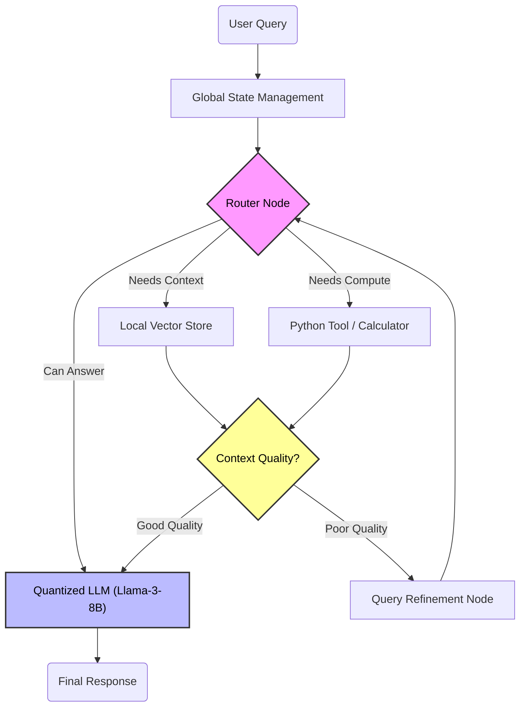
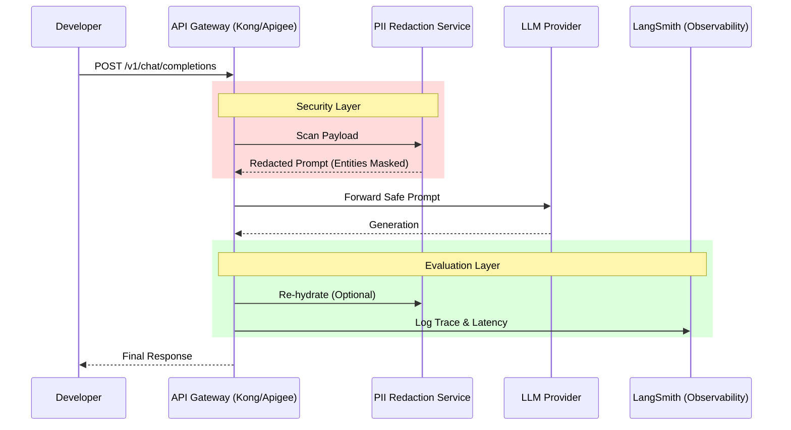

# SquishLabs Public Notes 🧪

**Welcome to the public brain dump of SquishLabs.**

Because my professional work involves high-compliance environments (US Defense & Tier-1 Banking), I cannot share my production code. However, I believe in **Architecture as Code**. 

This repository documents the reference architectures I research and build in my private lab, focusing on **Edge AI**, **Agentic Workflows**, and **Zero-Trust GenAI Gateways**.

---

## Architecture 1: "The Edge-Native Agent" (LangGraph Implementation)
**Concept:** Running a cyclic reasoning loop on constrained hardware (NVIDIA Jetson) without cloud dependency.
**Why LangGraph?** Standard chains are DAGs (Directed Acyclic Graphs). Real agents need *cycles* to reason, retry, and reflect.

## Architecture 2: "The Zero Trust" GenAI Gateway
**Concept:** How I architected secure LLM adoption for Financial Services.
**The Challenge:** Banks cannot send PII to an LLM provider.
**The Solution:** An interception layer that sanitizes before the prompt hits the model, and evaluates after the generation.

